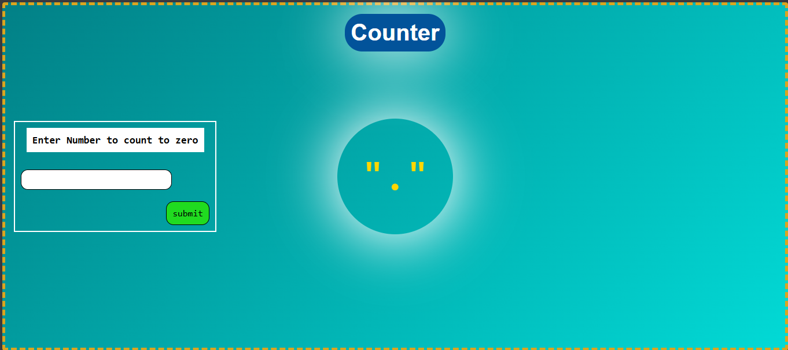

# ⏱️ Countdown Counter Project

A simple JavaScript project that demonstrates how to use **DOM manipulation** and **setInterval / clearInterval** to build a live countdown counter.

---

## 🚀 Features

- User can enter a number
- Start countdown by clicking the submit button
- Real-time decrement every 1 second
- Automatic stop when reaching zero
- Clean and simple UI design

---

## 🛠️ Technologies Used

- HTML5
- CSS3
- JavaScript 

---

## 📸 Preview

---

## 🎯 What I Learned

This project helped me practice:

- DOM selection and manipulation
- Event handling in JavaScript
- Using `setInterval` and `clearInterval`
- Working with user input
- Basic UI styling with CSS

---

## ⚙️ How It Works

1. The user enters a number in the input field.
2. Clicks the **Submit** button.
3. The counter starts decreasing every second.
4. When it reaches zero, the interval stops automatically.

---

## 🌐 Live Demo

[Click here to view live demo](https://omart-hub.github.io/js-countdown-timer/)

---

## 📌 Future Improvements

- Add Start / Pause / Reset buttons
- Add sound when countdown finishes
- Save last value using localStorage
- Make it responsive for mobile devices

---

## 👨‍💻 Author

Made by **Omar Ahmed** as a practice project while learning JavaScript DOM & Events.